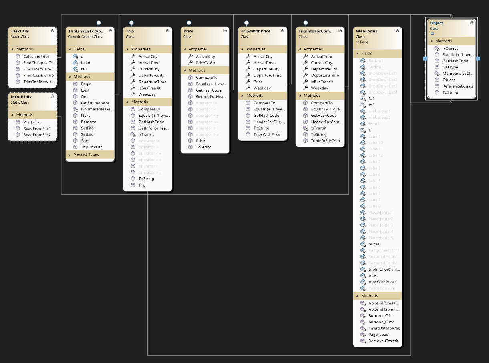
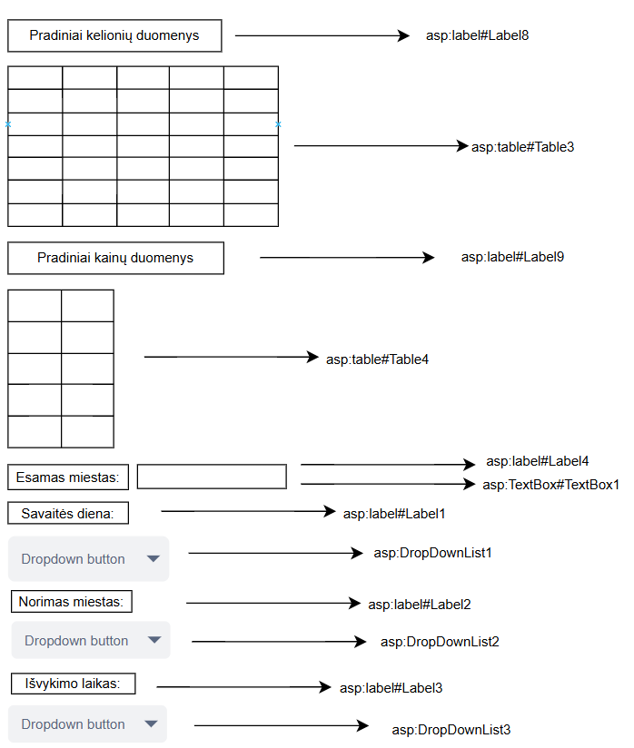
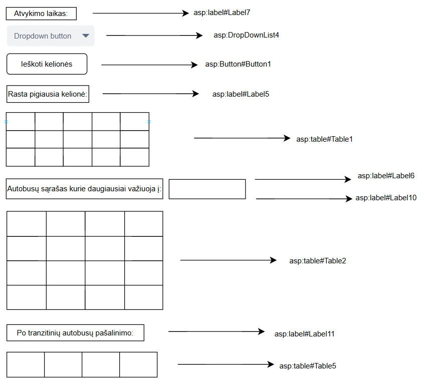

Bendrinių klasių projektas

# Apie
Šis projektas demonstruoja bendrinių klasių panaudojimą sprendžiant uždavinį.

# Naudotos technologijos
-Visual studio 2022
-Vartotojo sąsaja

# Užduotis 
LD_2. Kryžiažodis.
Duota k žodžių, kurie surašyti n x m išmatavimų lentelėje – kryžiažodyje.
Parašykite programą, kuri padėtų kryžiažodžių sprendimo mėgėjui išspręsti kryžiažodį – surastų lentelėje duotus
žodžius, vietoj kiekvieno surasto žodžio raidžių įrašytų žodžio eilės numerį. Rezultatuose pateikite kontrolines
sumas: stulpeliuose surašytų skaičių sumas.
Duomenys įvedami iš tekstinio failo ‘Kur3.txt’. Duomenų formatą studentas pasirenka ir suderina su savo
dėstytoju. Rezultatus išvedant į ekraną, pageidautinos spalvos.

# Programos naudotojo vadovas
Į duomenų failą U2a.txt yra įrašoma informacija apie autobusų maršrutus: pirmojoje eilutėje: 
esamos stoties miestas, tolesnėse v eilutėse – išvykimo miestas, išvykimo laikas, atvykimo miestas, 
atvykimo laikas, savaitės diena. Tekstiniame faile U2b.txt įrašoma informacija apie maršrutų kainas: 
atvykimo miestas, kaina. Atsidariusioje programoje matomi du failų įkėlimo laukai. Į juos įkeliami 
kelionių ir kainų failai su pradiniais duomenimis. Spaudžiamas mygtukas “Įkelti”. Ekrane matomi 
pradiniai kelionių ir kainų duomenys. Žemiau pateikta pasirinkimų sarašai. Reikia pasirinkti: savaitės 
dieną, norimą miestą, išvykimo laiką ir atvykimo laiką. Rodomas esamas miestas. Paspaudus mygtuką 
“Ieškoti kelionės” matoma lantelė su rastomis pigiausiomis kelionėmis pagal nurodytas reikšmes. 
Žemiau yra pateikta lentelė su antrašte, į kuri miestą keliauja daugiausiai autobusų. Lentelėje yra 
autobusų sąrašas, būtent tų kelionių, kurios važiuoja į dažniausią miestą. Žemiau yra dar viena lentelė 
su sąrašu autobusų be tranzitinių autobusų.

# Papildomai

  
 