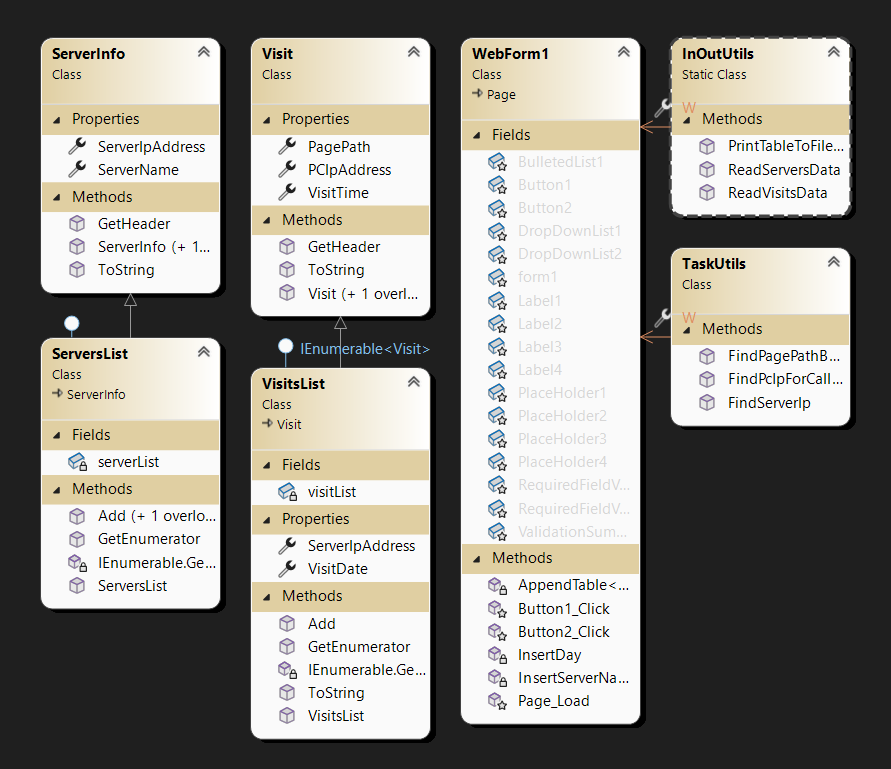
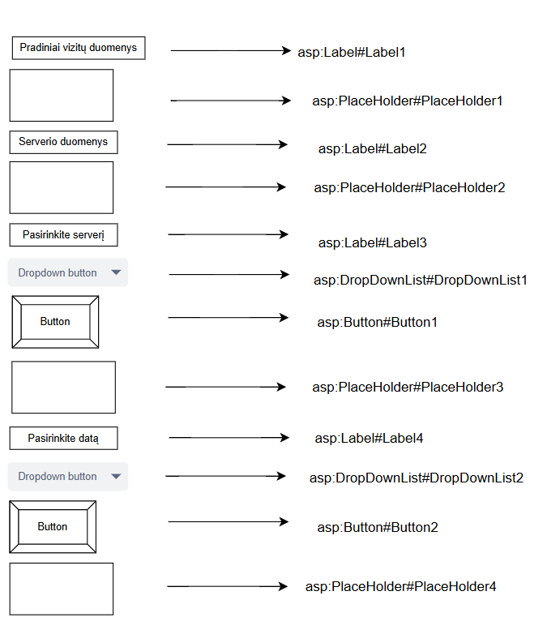

LINQ projektas

# Apie
Šis projektas demonstruoja LINQ panaudojimą sprendžiant uždavinį.

# Naudotos technologijos
-Visual studio 2022
-Vartotojo sąsaja

# Užduotis 
U5_2. Serveris. Kataloge registruojama informacija apie WWW serverių lankymą. Atskiruose failuose
saugoma kiekvienos dienos informacija. Failo pirmoje eilutėje yra dienos data ir serverio IP adresas
(xxx.xxx.xxx.xxx). Kitose eilutėse saugoma lankymo informacija: kreipimosi laikas (hh:mm:ss); kompiuterio IP
adresas; puslapio, į kurį buvo kreiptasi, pavadinimas su pilnu keliu. Kiekviena IP adreso xxx grupė tai sveikas
skaičius, iš intervalo [0, 255]. Atskirame faile yra serverių vardai: serverio IP adresas; serverio simbolinis
adresas. Sudaryti programą, kuri atkurtų pasirinkto (per DropDownList) serverio (naudoti simbolinį vardą)
svetainės struktūrą (puslapio, į kurį buvo kreiptasi, pavadinimas su pilnu keliu - nesikartojant). Rikiuoti
(kompiuterio IP adresas, kreipimosi laikas). Surasti kompiuterio IP, į kurį nurodytą dieną (įvedama arba
pasirenkama iš iškrentančio sąrašo) buvo kreiptasi daugiausiai kartų. Atspausdinti surastą kartų kiekį ir
kompiuterio IP. Jei yra keli tokie kompiuteriai, atspausdinti visus.

# Programos naudotojo vadovas
Atsidarę programą, į failų aplanką „App_Data“ pridėkite tekstinį failą su pavadinu „Info*.txt“ -
* yra skaičius. Failo pirmoje eilutėje įrašykite dienos datą ir serverio IP adresą. Tolesnėse eilutėse 
parašykite kreipimosi laiką, kompiuterio IP adresą, puslapio, į kurį buvo kreiptasi, pavadinimą su pilnu 
keliu. Kitame faile „Servers.txt“ įrašykite serverio IP adresą ir serverio simbolinį adresą. Paleiskite 
programą ir pasirinkite serverį bet datą.

# Papildomai

  
