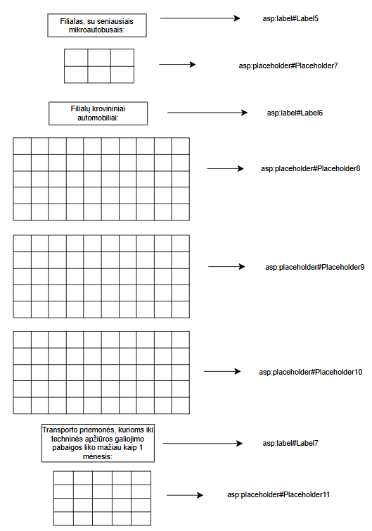

Polimorfizmo projektas

# Apie
Šis projektas demonstruoja polimorfizmo panaudojimą sprendžiant uždavinį.

# Naudotos technologijos
-Visual studio 2022
-Vartotojo sąsaja

# Užduotis 
U4_2. Automobilių parkas. VšĮ „Greitis“ plečiasi ir atidaro naujus filialus (>=3). Pirmoje eilutėje yra
miestas, antroje – adresas, trečioje – e-pašto adresas. Toliau informacija apie automobilius. Įmonės
automobilių parką sudaro lengvieji automobiliai, krovininiai automobiliai ir mikroautobusai. Sukurkite
abstrakčiąją klasę „Transport“ (savybės – valstybinis numeris, gamintojas, modelis, pagaminimo metai ir
mėnuo, atliktos techninės apžiūros data, kuras, vidutinės kuro sąnaudos (100 km)), kurią paveldės klasės
„Car“ (savybė – odometro rodmenys), „Truck“ (savybė – priekabos talpa) ir „Microbus“ (savybė – sėdimų
vietų skaičius).
• Raskite geriausią transporto priemonę kiekvienoje grupėje, atspausdinkite jos gamintoją, modelį,
valstybinius numerius ir amžių. Lengvasis geriausias – nuvažiuota mažiausiai kilometrų, krovininis
geriausias – didžiausia priekabos talpa, mikroautobusas geriausias – daugiausia sėdimų vietų.
• Raskite, kuriame filiale mikroautobusai yra seniausi (vidutinis jų amžius didžiausias). Filialo
duomenis atspausdinkite ekrane.
• Sudarykite kiekvieno filialo krovininių automobilių sąrašą, surikiuokite pagal gamintoją ir modelį.
• Nustatykite kiekvienai transporto priemonei artimiausios techninės apžiūros datą, jei lengvajam
automobiliui techninė apžiūra galioja 2 metus, kroviniam automobiliui – metus, o mikroautobusui
– pusę metų. Į failą „Apžiūra.txt“ įrašykite tų transporto priemonių duomenis (transporto
priemonių gamintojus, modelius, valstybinius numerius, techninės apžiūros galiojimo pabaigą),
kurioms iki techninės apžiūros galiojimo pabaigos liko mažiau kaip 1 mėnesis. Jei techninės
apžiūros galiojimas pasibaigęs, tuos automobilius pažymėkite papildomais ženklais.

# Programos naudotojo vadovas
Į duomenų aplanką „App_Data“ įkelkite failus, kuriuose: pirmoje eilutėje nurodytas filialo 
miestas, adresas ir e-pašto adresas. Tolesnėse eilutėse nurodykite transporto tipo pirmąją raidę, 
valstybinį numerį, transporto priemonės gamintoją, modelį, pagaminimo metus ir mėnesį, atliktos 
techninės apžiūros datą, kuro tipą, vidutines kuro sąnaudas. Automobiliams nurodykite odometro 
duomenis, krovininiams automobiliams nurodykite priekabos talpą, o mikroautobusams nurodykite 
sėdimų vietų skaičių.

# Papildomai

  
  
