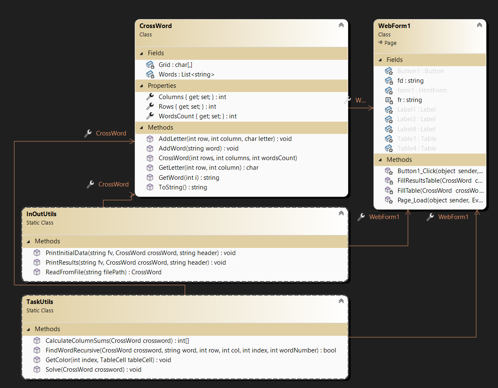
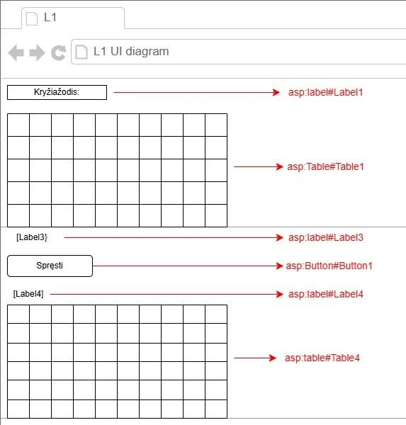

Rekursijos projektas

# Apie
Šis projektas demonstruoja rekursijos panaudojimą sprendžiant uždavinį.

# Naudotos technologijos
-Visual studio 2022
-Vartotojo sąsaja

# Užduotis 
LD_2. Kryžiažodis.
Duota k žodžių, kurie surašyti n x m išmatavimų lentelėje – kryžiažodyje.
Parašykite programą, kuri padėtų kryžiažodžių sprendimo mėgėjui išspręsti kryžiažodį – surastų lentelėje duotus
žodžius, vietoj kiekvieno surasto žodžio raidžių įrašytų žodžio eilės numerį. Rezultatuose pateikite kontrolines
sumas: stulpeliuose surašytų skaičių sumas.
Duomenys įvedami iš tekstinio failo ‘Kur3.txt’. Duomenų formatą studentas pasirenka ir suderina su savo
dėstytoju. Rezultatus išvedant į ekraną, pageidautinos spalvos.

# Programos naudotojo vadovas
Programos aplanke App_Data sukuriame tekstinį duomenų failą Kur3.txt. Tekstiniame faile 
pirmoje eilutėje nurodykite kiek jūsų kuriamame kryžiažodyje bus eilučių. Antroje eilutėje nurodykite 
kiek bus stulpelių. Tada po vieną raidę su tarpais išdėstykite žodžius. Galima vertikaliai ir horizontaliai. 
Apačioje kryžiažodžio lentelės įrašykite žodžius kuriuos reikės surasti. 
Paleidus programą, ekrane matysite kryžiažodį, o paspaudus mygtuką „Spręsti“, pamatysite 
naują lentelę su jau išspręstu kryžiažodžiu ir kiekviename raidės langelyje skaičių, žodžio, kuris ten 
buvo. Paskutinėje eilutėje matysite stulpelių sumas.

# Papildomai

  
