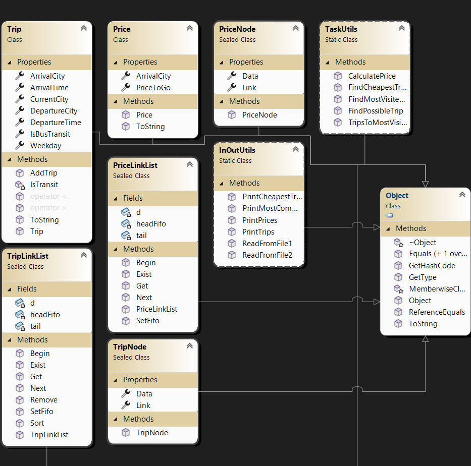

Dinaminio atminties valdymo projektas

# Apie
Šis projektas demonstruoja dinaminio atminties valdymo panaudojimą sprendžiant uždavinį.

# Naudotos technologijos
-Visual studio 2022
-Vartotojo sąsaja

# Užduotis 
LD_2. Autobusų stotis. Autobusai veža keleivius iš stoties. Kai kurie autobusai pradeda kelionę iš
esamos stoties, kiti yra tranzitiniai. Tranzitiniams autobusams bilietų kaina yra 10% mažesnė.
Suraskite, ar galima nurodytą savaitės dieną iš esamo miesto nukeliauti į norimą miestą nurodytame
laiko intervale. Jei taip, suraskite tarp jų pigiausią kelionę. Suraskite, į kurį miestą važiuoja daugiausiai
autobusų ir sudarykite iš jų atskirą sąrašą (išvykimo miestas, išvykimo laikas, atvykimo laikas, savaitės
diena). Spausdinamas sąrašas turi būti surikiuotas pagal išvykimo miestą abėcėlės ir pagal išvykimo
laiką didėjimo tvarka. Pašalinkite iš šio sąrašo tranzitinius autobusus.
 Tekstiniame faile U2a.txt duota informacija apie autobusų maršrutus: pirmojoje eilutėje:
esamos stoties miestas, tolesnėse eilutėse – išvykimo miestas, išvykimo laikas, atvykimo
miestas, atvykimo laikas, savaitės diena.
 Tekstiniame faile U2b.txt duota informacija apie maršrutų kainas: atvykimo miestas, kaina.

# Programos naudotojo vadovas
Į duomenų failą U2a.txt yra įrašoma informacija apie autobusų maršrutus: pirmojoje eilutėje: 
esamos stoties miestas, tolesnėse eilutėse – išvykimo miestas, išvykimo laikas, atvykimo miestas, 
atvykimo laikas, savaitės diena. Tekstiniame faile U2b.txt įrašoma informacija apie maršrutų kainas: 
atvykimo miestas, kaina. Atsidariusioje programoje matomi pradiniai kelionių ir kainų duomenys. 
Žemiau pateikta pasirinkimų sarašai. Reikia pasirinkti: savaitės dieną, norimą miestą, išvykimo laiką ir 
atvykimo laiką. Rodomas esamas miestas, jį galima keisti. Paspaudus mygtuką “Ieškoti kelionės” 
matoma lantelė su rastomis pigiausiomis kelionėmis pagal nurodytas reikšmes. Žemiau yra pateikta 
lentelė su antrašte, į kuri miestą keliauja daugiausiai autobusų. Lentelėje yra autobusų sąrašas, būtent tų 
kelionių, kurios važiuoja į dažniausią miestą. Žemiau yra dar viena lentelė su sąrašu autobusų be 
tranzitinių autobusų.

# Papildomai

  
  